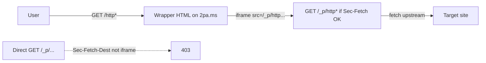

# Re-enabling JavaScript in the 2pams Proxy — Safely

A step-by-step tutorial describing how **2pams** serves proxied pages with **JavaScript enabled** without giving that code the full power of the `2pa.ms` origin (cookies, `localStorage`, Service Workers, same-origin `fetch` to your app, etc.).

**What is implemented in this repo today**

- [`src/index.ts`](../src/index.ts): two routes — `GET /http*` returns a **wrapper page** with a **sandboxed `<iframe>`**; `GET /_p/http*` serves the **real proxied HTML** (scripts intact). The inner route requires [`Sec-Fetch-Dest: iframe`](https://developer.mozilla.org/en-US/docs/Web/HTTP/Headers/Sec-Fetch-Dest) and [`Sec-Fetch-Site: same-origin`](https://developer.mozilla.org/en-US/docs/Web/HTTP/Headers/Sec-Fetch-Site) so direct / phishing top-level links to `/_p/...` return **403**.
- [`Caddyfile.prod`](../Caddyfile.prod) / [`Caddyfile.dev`](../Caddyfile.dev): two **header** profiles — a strict one for the trusted surface, a permissive one for `/_p/*` (so proxied third-party sites can run inline/eval’d JS) plus `worker-src 'none'`, `frame-ancestors 'self'`, strip cookies, `COEP: credentialless`, etc.

---

## 0. The threat model in one paragraph

If proxied JavaScript ran as a **normal** document on `https://2pa.ms`, the browser’s [same-origin policy](https://developer.mozilla.org/en-US/docs/Web/Security/Same-origin_policy) would treat it as first-party: it could read your cookies, write to `localStorage`, register a [Service Worker](https://developer.mozilla.org/en-US/docs/Web/API/Service_Worker_API), frame your UI for [clickjacking](https://owasp.org/www-community/attacks/Clickjacking), and abuse the user’s browser as a pivot. Relying only on HTML sanitization to delete `<script>` is fragile against [mutation XSS](https://research.securitum.com/the-curious-case-of-copy-paste/) and [parser differences](https://portswigger.net/research/dom-clobbering-strikes-back). The design here is **containment**: run third-party documents inside an **opaque origin** (via [`<iframe sandbox>`](https://developer.mozilla.org/en-US/docs/Web/HTML/Element/iframe#sandbox) *without* `allow-same-origin`) and add **defense-in-depth** HTTP headers on the wire.

Background reading:

- OWASP — [Cross-Site Scripting (XSS)](https://owasp.org/www-community/attacks/xss/) and the [XSS Prevention Cheat Sheet](https://cheatsheetseries.owasp.org/cheatsheets/Cross_Site_Scripting_Prevention_Cheat_Sheet.html)
- PortSwigger — [Cross-site scripting](https://portswigger.net/web-security/cross-site-scripting), [SSRF](https://portswigger.net/web-security/ssrf)
- Google — [A strict CSP helps mitigate XSS](https://web.dev/articles/strict-csp)
- MDN — [Content Security Policy](https://developer.mozilla.org/en-US/docs/Web/HTTP/CSP)

---

## 1. Single-domain split-route + iframe `sandbox` (the default in this project)

This is the primary architecture shipped in the codebase.



1. **Wrapper (`GET /http*`)** — Returns a minimal HTML page whose only job is to embed the proxied document: `<iframe src="/_p/http" + <same-capture-as-before> sandbox="allow-scripts allow-forms allow-popups allow-popups-to-escape-sandbox" allow="" …>`. With **`allow-scripts` but not `allow-same-origin`**, the framed document’s origin is a [unique opaque origin](https://html.spec.whatwg.org/multipage/origin.html#concept-origin-opaque): scripts run, but they **cannot** read `2pa.ms` storage or register a service worker scoped to a stable origin. Eric Lawrence’s [Sandbox and Same-Origin: A Cautionary Tale](https://textslashplain.com/2018/04/12/sandboxing-iframes/) is required reading: **never** combine `allow-scripts` and `allow-same-origin` if you are trying to contain JS.

2. **Inner (`GET /_p/http*`)** — Reuses the same `http` + `req.params[0] → new URL(…)` parsing as the historical single route, but at the start it enforces:
   - `sec-fetch-dest` **must** be `iframe` (kills top-level phishing links; see [MDN: Sec-Fetch-Dest](https://developer.mozilla.org/en-US/docs/Web/HTTP/Headers/Sec-Fetch-Dest));
   - `sec-fetch-site` **must** be `same-origin` (only our wrapper can request it; see [MDN: Sec-Fetch-Site](https://developer.mozilla.org/en-US/docs/Web/HTTP/Headers/Sec-Fetch-Site)).  
   Browsers that omit `Sec-Fetch-*` (very old) will be blocked; that is an intentional trade-off.  
   `app.set('trust proxy', 1)` (see [Express: Behind Proxies](https://expressjs.com/en/guide/behind-proxies.html)) is set so the stack sees the correct host behind Caddy.

3. **Response hardening** — The handler strips `Set-Cookie` and sends `Cache-Control: no-store` on proxied bodies so upstream responses can’t plant state. It still uses `isSafeUrl` + `redirect: 'manual'` to mitigate **SSRF** on the server; that is orthogonal to browser JS (see [OWASP SSRF Prevention](https://cheatsheetseries.owasp.org/cheatsheets/Server_Side_Request_Forgery_Prevention_Cheat_Sheet.html) and [PortSwigger: SSRF](https://portswigger.net/web-security/ssrf)). A `javascript:`-only strip on `href` / `src` / `action` is kept as cheap defense in depth; `<script>` and `on*` attribute stripping is **not** used anymore.

---

## 2. Caddy: two response profiles (what each header is for)

Caddy is configured with a matcher `@proxied path /_p/*` so responses from `/_p/...` get the **sandbox** policy; everything else gets the **trusted UI** policy. Directive reference: [Caddy `header`](https://caddyserver.com/docs/caddyfile/directives/header) and [Caddy `handle`](https://caddyserver.com/docs/caddyfile/directives/handle).

### Profile A — not under `/_p/*` (trusted: wrapper, `/health`, `public/`)

| Header | Rationale |
|--------|-----------|
| `Content-Security-Policy` with `default-src 'self'`, `script-src 'self'`, `frame-ancestors 'none'`, `frame-src 'self'` | Locks your own static assets; only same-origin is allowed to frame, and the wrapper may only load an iframe from `self` (the `/_p/...` URL is same-origin). [strict CSP](https://web.dev/articles/strict-csp) |
| `X-Frame-Options: DENY` | Redundant with `frame-ancestors` for legacy UAs. [MDN](https://developer.mozilla.org/en-US/docs/Web/HTTP/Headers/X-Frame-Options) |
| `Cross-Origin-Opener-Policy: same-origin` | Hardens `window` relationships / tab-nabbing. [web.dev: COOP](https://web.dev/articles/why-coop-coep) |
| `Cross-Origin-Resource-Policy: same-origin` | The trusted origin’s responses aren’t subresource-loadable from random sites. [MDN: CORP](https://developer.mozilla.org/en-US/docs/Web/HTTP/Headers/Cross-Origin-Resource-Policy) |
| `Strict-Transport-Security` (prod only) | HSTS: browser only uses HTTPS. [HSTS preload](https://hstspreload.org/) |
| `X-Content-Type-Options: nosniff` | Disables dangerous MIME sniffing. [MDN](https://developer.mozilla.org/en-US/docs/Web/HTTP/Headers/X-Content-Type-Options) |
| `Referrer-Policy: no-referrer` | Upstream sites don’t see the full `2pams` URL. [MDN](https://developer.mozilla.org/en-US/docs/Web/HTTP/Headers/Referrer-Policy) |
| `Permissions-Policy` (feature opt-out list) | Disables powerful APIs. [web.dev: Permissions-Policy](https://developer.chrome.com/docs/privacy-security/permissions-policy) / [permissionspolicy.com](https://www.permissionspolicy.com/) |
| `-Server` | Hides the `Server` banner. [Caddy `-header`](https://caddyserver.com/docs/caddyfile/directives#header) |

### Profile B — `/_p/*` (proxied document)

| Header | Rationale |
|--------|-----------|
| `default-src` / `img-src` include `https:` and `'unsafe-inline'` / `'unsafe-eval'` | Real sites need inline and eval; containment is the iframe, not a tight CSP. |
| `worker-src 'none'` | Stops [Service Worker](https://developer.mozilla.org/en-US/docs/Web/HTTP/Headers/Content-Security-Policy/worker-src) registration even on the same host — no persistent “take the domain” via SW. |
| `frame-ancestors 'self'` | Only your wrapper (same origin) can embed; arbitrary sites can’t frame the proxied page for UI redress. [CSP3](https://www.w3.org/TR/CSP3/#directive-frame-ancestors) |
| `form-action 'none'`, `base-uri 'none'`, `object-src 'none'` | Mitigates form exfil, `<base>` trickery, and legacy object/embed vectors. [strict-CSP: object-src](https://web.dev/articles/strict-csp#step-2_set-an-object_src_none_directive) |
| `Cross-Origin-Embedder-Policy: credentialless` + `Cross-Origin-Resource-Policy: cross-origin` | Picks a cross-origin isolated posture compatible with hot-linked assets; see [COEP `credentialless`](https://wicg.github.io/credentiallessness/) and [web.dev: COOP/COEP](https://web.dev/articles/why-coop-coep) |
| `-Set-Cookie` and `request_header -Cookie` | The sandbox must not accrue or forward cookies. |

`Caddyfile.dev` omits `Strict-Transport-Security` on the inner block for local `tls internal` — easier local testing. Production `Caddyfile.prod` includes HSTS on both handles.

**Validate the Caddyfile** before deploy:

```bash
caddy validate --config Caddyfile.prod --adapter caddyfile
```

---

## 3. Verification checklist

1. **Headers (smoke)**  
   ```bash
   curl -sI "https://<host>/https://example.com" | grep -iE 'content-security|frame-ancestors|cross-origin'
   curl -sI "https://<host>/_p/https://example.com" -H "Sec-Fetch-Dest: iframe" -H "Sec-Fetch-Site: same-origin" | grep -iE 'content-security|set-cookie|worker-src'
   ```
2. **Direct /_p/ is blocked** — Without `Sec-Fetch-*` iframe headers, expect `403` from Express.
3. **CSP in browser** — Paste both policies into [CSP Evaluator](https://csp-evaluator.withgoogle.com/); the `/_p/*` policy will flag `'unsafe-inline'` / `'unsafe-eval'` — that is expected.
4. **Hardening tools** — [securityheaders.com](https://securityheaders.com/), [Mozilla Observatory](https://observatory.mozilla.org/) (scores are relative to each profile).
5. **SSRF** — The server must still reject private IPs, redirects, and non-`http(s):` — covered by existing tests / manual `curl` against your deployment.

---

## 4. Optional: second registrable domain (when you add auth, cookies, or APIs)

If `2pa.ms` later stores **sessions, SW, or API cookies**, consider moving proxied output to a **separate eTLD+1** (e.g. `2pams-content.app`) so cookies never overlap with user-content — see the [Public Suffix List](https://publicsuffix.org/) and [SameSite / eTLD+1](https://web.dev/articles/same-site-same-origin). That pattern is the same as [Google user-content hosts](https://cloud.google.com/blog/products/workspace/how-google-docs-protects-from-html-based-attacks) or GitHub’s [raw and asset hosts](https://github.blog/2013-05-22-non-jekyll-pages-and-redirects/). The single-domain + `iframe` design in this repo is enough for a static landing and open proxy with **no** first-party state.

---

## 5. What we deliberately did *not* solve

- **Relative link navigation inside the iframe** — The proxy rewrites `link[rel=stylesheet]` the same as before; full-site navigation / asset rewriting is unchanged.
- **CSP `report-uri`** — You can add a reporting endpoint and point `Content-Security-Policy-Report-Only` or `report-to` at it: [MDN: CSP reporting](https://developer.mozilla.org/en-US/docs/Web/HTTP/CSP#using_content_security_policy).
- **Global rate limits** — Consider Caddy [rate limit](https://github.com/mholt/caddy-ratelimit) or `express-rate-limit` for the `/http*` and `/_p/http*` entry points.

---

## 6. Further reading

- HTML — [`iframe` `sandbox`](https://html.spec.whatwg.org/multipage/iframe-embed-object.html#attr-iframe-sandbox)
- Mike West / W3C TAG — [Origin and security (PDF slide deck)](https://www.w3.org/2011/webappsec/talks/origin-security.pdf)
- Jake Archibald — [Service Workers: an introduction](https://web.dev/articles/service-workers-introduction) (and why `worker-src 'none'` on `/_p/*` matters)
- Cure53 — [DOMPurify](https://github.com/cure53/DOMPurify) (if a future feature needs sanitization, don’t hand-roll)
- Caddy — [reverse_proxy](https://caddyserver.com/docs/caddyfile/directives/reverse_proxy)

### Dev-only note

- Remove `DASHBOARD_USER` / `DASHBOARD_PASSWORD` from your local `.env` if you had them; the `dashboard.*` Caddy vhosts and compose env were removed from this project.
